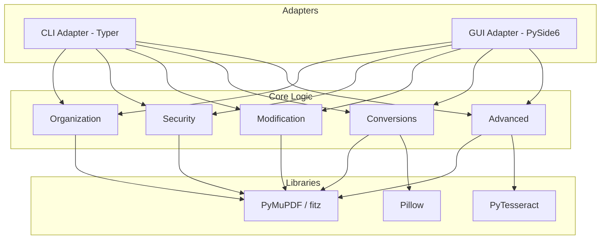
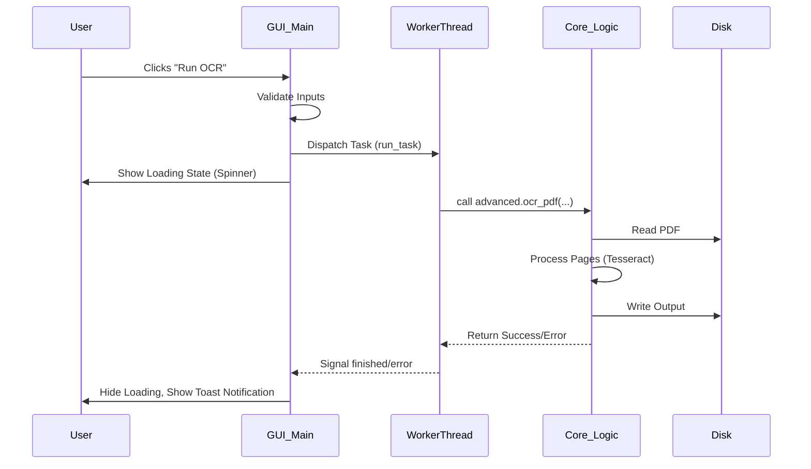
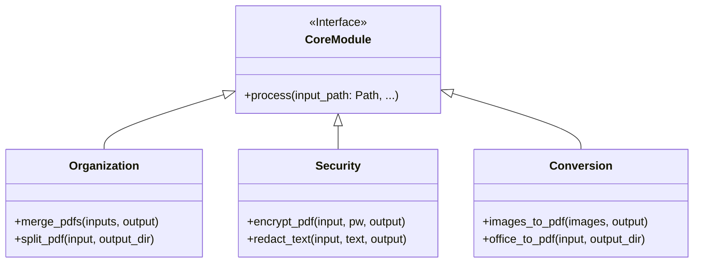

# ManiPDF Repository Analysis

This document provides an extensive analysis of the **ManiPDF** project from the perspectives of a Product Manager, Software Architect, and Software Developer.

## 1. Product Manager Perspective

### 1.1 Value Proposition
ManiPDF is a **privacy-first, local-only** PDF manipulation suite. It addresses the growing concern of data privacy by ensuring that sensitive documents are processed entirely on the user's machine, eliminating the need for online PDF tools that may store or analyze user data.

### 1.2 Target User Personas
*   **Power Users & Developers**: Prefer the speed and scriptability of the CLI for batch processing.
*   **General Users & Office Workers**: Require a friendly, visual interface (GUI) for occasional PDF tasks.
*   **Privacy-Conscious Professionals**: (Lawyers, accountants, etc.) who handle highly confidential documents and cannot use cloud services.

### 1.3 Feature Matrix
| Category | Features |
| :--- | :--- |
| **Organization** | Merge, Split, Delete, Extract, Sort, Rotate, N-up (Grid layout), Overlay (Stamp) |
| **Security** | AES-256 Encryption, Decryption, Text Redaction (Black-boxing), Watermarking |
| **Modification** | Find & Replace Text, Page Numbering, Compression |
| **Conversions** | Images to PDF, PDF to Images, Office to PDF (via LibreOffice), Image Extraction |
| **Advanced** | OCR (Searchable PDF), Visual Comparison, Create Blank PDF |

### 1.4 Roadmap
*   **Near-term**: Standalone executables for Windows/macOS/Linux via PyInstaller.
*   **Mid-term**: Real-time visual PDF viewer for drag-and-drop page organization.
*   **Long-term**: Support for more complex Office formats and digital signatures.

---

## 2. Software Architect Perspective

### 2.1 Architectural Pattern: Core-Adapter
ManiPDF employs a **Core-Adapter (Hexagonal-lite)** architecture. This decouples the "business logic" (PDF manipulation) from the "delivery mechanisms" (CLI and GUI).

### 2.2 Technology Stack
*   **Language**: Python 3.12+ (Strict typing with `mypy`).
*   **Core Engine**: `PyMuPDF` (fitz) - high-performance PDF rendering and manipulation.
*   **CLI**: `Typer` & `Rich` - for a modern, colorful terminal experience.
*   **GUI**: `PySide6` (Qt for Python) - for a cross-platform desktop experience.
*   **OCR**: `Tesseract` via `pytesseract`.
*   **Images**: `Pillow` and `pdf2image`.

### 2.3 Data Flow: GUI Async Processing
To prevent UI freezing during heavy PDF operations (like OCR or merging large files), the GUI uses a Thread Pool pattern.

---

## 3. Software Developer Perspective

### 3.1 Directory Structure
*   `src/manipdf/core/`: Contains pure functional implementations. No UI code allowed here.
*   `src/manipdf/cli/`: Maps CLI commands to core functions using Typer.
*   `src/manipdf/gui/`: Implements the PySide6 UI, custom widgets, and theme management.
*   `tests/`: Comprehensive test suite mirrored against the `core` modules.

### 3.2 Key Modules & Responsibilities
*   **`core/organization.py`**: Handles structural changes (merging, splitting, reordering).
*   **`core/security.py`**: Manages encryption and redaction. Note: Redaction uses `page.add_redact_annot` followed by `page.apply_redactions`.
*   **`core/conversions.py`**: Interacts with the filesystem and external tools like LibreOffice.
*   **`gui/main.py`**: A large file containing the UI definition. Uses a `ToolTab` base class to standardize background task execution.

### 3.3 Development Guidelines
*   **Type Safety**: All new functions must have type hints. Run `mypy` before committing.
*   **Linting**: Follow the Ruff configuration in `pyproject.toml`.
*   **Core-First**: Implement new features in `core/` first, then add them to CLI and GUI.

### 3.4 Testing Strategy
The project uses `pytest`. Tests are categorized by module:
*   `test_organization.py`: Verifies merging/splitting logic.
*   `test_security.py`: Tests encryption/decryption cycles.
*   `test_advanced.py`: Tests OCR (mocking Tesseract where necessary).

---

## 4. Technical Deep Dive

### 4.1 Core Object Model (Simplified)
While `PyMuPDF` handles the heavy lifting, the internal logic revolves around `fitz.Document` and `pathlib.Path` objects.

### 4.2 Error Handling Strategy
*   **CLI**: Uses `typer.Exit(code=1)` and `rich.console.Console` for user-friendly error messages.
*   **GUI**: Catches exceptions in the `PdfWorker`, formatting the traceback and emitting a signal to the main thread to show a "Red Toast" notification.
*   **Core**: Raises standard Python exceptions (e.g., `FileNotFoundError`, `RuntimeError`) which are then handled by the adapters.

---

*Compiled on May 7, 2026, by Gemini CLI.*
